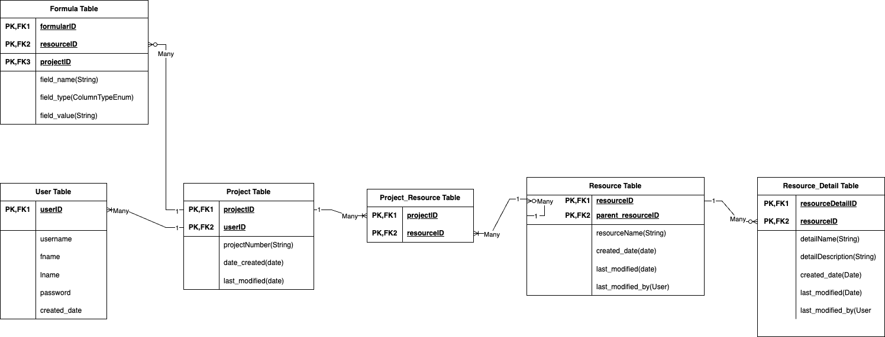

# Korera
Korera is a construction management system designed to offer a wide range of functionalities. 
It empowers users with secure authentication, efficient resource management, 
and streamlined project and formula administration.

## Server

Built on the Java Spring framework, this project encompasses six essential entities: 
- User
- Project
- Resource
- ResourceDetail
- Formula.

## Database Diagram

